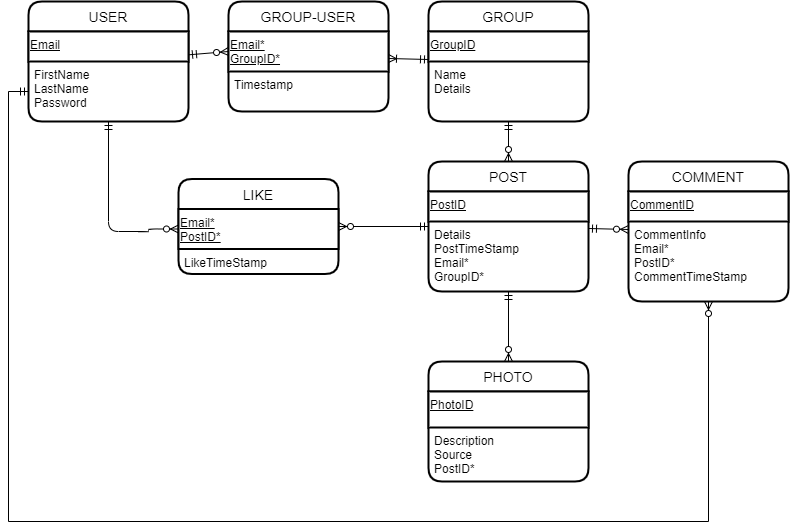

#Visual Roll
##Share pictures between friends and family.

*Visual Roll* is a cluster.co clone that aims to provide a space for users to share images privately among friends and family. 

Share photos of groups, events and occasions between other members by invite only. This invite only function will help keep your photos private and only shared with those you actually want to be able to see, unlike most photo sharing sites that allow sharing with all accepted friends/followers with occasional restriction settings (that can are quite difficult to use regularly).
 
Get notifications for every like and new photo added to one of your groups/albums.

Using *server side rendering* will allow this site to be loaded faster, improving user experiences. 

###Developer Journal
Date | Time | Estimate | Actual | Description | Notes
------------ | ------------- | ------------- | ------------- | ------------- | -------------
28/08/20 | 7:30am | 20mins | 30mins | Review assignment brief	
28/08/20 | 10:50am | 20mins | 15mins | Draft documentation | Set up basic documentation and draft ideas
29/08/20 | 6:00pm | 20mins | 10mins | Learn fundamentals of Markdown Language | Learn how to do titles, tables and emphasis.
31/09/20 | 12:30pm | 40mins | 50mins | Draft README file | Including developer journal table.
03/09/20 | 2:30pm | 60mins | 50mins | Set up project on laptop and draft tasks | Cloning initial project and draft tasks on paper
04/09/20 | 3:00pm | 60mins | 60mins | Design database and finalise tasks | Draft ERD and standard relation notation, and check that against cluster.co website
06/09/20 | 7:30pm | 60mins | 90mins | Finalise ERD, documentation, submit and add tasks to Github.	
12/09/20 | 1:00pm | 90mins | 120mins | Researching Github & setting up Database.	| Had issues with putting local files onto Github (Still not resolved), Used models to set up Database.
17/09/20 | 7:30am | 60mins | Most of day | Fix github | Had many troubles with Windows 10 update that didn't fully work and didn't actually get to sorting github out.
18/09/20 | 2:00pm | 60mins | 10mins | Fix github issues 2.0 | Finally fixed Github problems
18/09/20 | 2:10pm | 60mins | mins | Update developers log & setting up  first 3 pages | Updating log to reflect issues & set up  registration/Sign in/Create Group pages.

###Database Design: *ERD*

